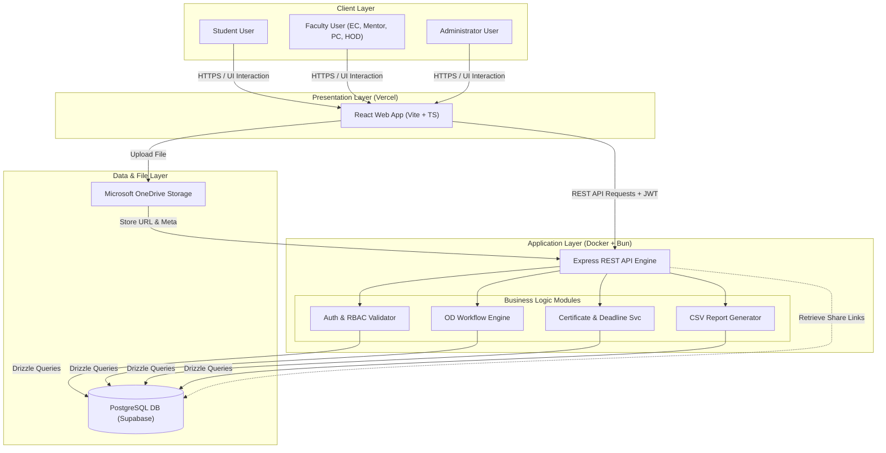

# System Architecture Design

This document details the system design, core infrastructure layout, data flow patterns, and recommended directory structure for the MCET AI&DS OD Approval Web Application.

---

## 1. System Architecture Overview

The system uses a classic **Three-Tier Web Architecture** built with modern web technologies:

1. **Presentation Layer (Frontend):** A Client-Side Single Page Application (SPA) built using React, TypeScript, and Tailwind CSS (configured with Shadcn UI elements). Served statically using a modern bundler (Vite) and hosted on Vercel.
2. **Application Layer (Backend):** A stateless RESTful API server built using Express.js and TypeScript, executing on the fast Bun runtime containerized inside Docker.
3. **Data Layer (Storage):**
   - **Relational Metadata:** PostgreSQL database mapping core tables, records, approvals, and history, managed via Drizzle ORM.
   - **Binary Document Storage:** External file hosting using Microsoft OneDrive (via OneDrive Shared Link API), preventing binary bloat in the local relational database.

### 1.1 Architecture Flowchart



---

## 2. Key Data Flows

### 2.1 Authentication & RBAC Flow
1. User enters username and password in the React login view.
2. React client makes a POST request to `/api/auth/login`.
3. Backend retrieves matching record from `USERS` table, verifies password via `bcryptjs.compare`, and signs a JWT containing the user ID and role.
4. JWT is returned to the client and stored in local memory or secure cookies.
5. For all subsequent requests, the client adds the JWT in the `Authorization: Bearer <token>` header. The backend middleware validates the token signature and verifies the request role matches the route's RBAC specifications.

### 2.2 OD Application Submission & Approval Flow
1. Student inputs event details in React form and submits it.
2. React sends a POST request to `/api/applications`.
3. Backend creates an entry in `OD_APPLICATIONS` (Status: `In Progress: Event Coordinator`).
4. The Event Coordinator dashboard polls or updates, showing the new request.
5. The Event Coordinator clicks Approve. Backend checks permissions, adds a record to `APPLICATION_APPROVAL_HISTORY`, and updates the application status to `In Progress: Mentor`.
6. This cycle repeats for the Mentor, Program Coordinator, and HOD.
7. Once HOD approves, the application status becomes `Approved` and `final_approved_at` is timestamped.

### 2.3 Certificate Upload & Verification Flow
1. Once the application is approved and event dates pass, the student's portal exposes the upload option.
2. Student uploads the certificate to a designated Microsoft OneDrive shared folder.
3. The student pastes the OneDrive share link and submits it (POST to `/api/certificates`).
4. Backend creates an entry in `CERTIFICATES` pointing to the `CERTIFICATE_REQUIREMENTS` row, status changes to `Uploaded`.
5. The Event Coordinator reviews the document from their certificate verification queue dashboard.
6. The EC approves or rejects. The certificate state changes to `Verified` or `Rejected` based on the outcome.

---

## 3. Project Directory Layout

The workspace is organized as a monorepo or dual-directory setup to split frontend and backend layers cleanly.

```
/ (Workspace Root)
├── backend/                           # Express.js API Server
│   ├── src/
│   │   ├── controllers/               # Express request and response handlers
│   │   ├── middleware/                # JWT validation, error and RBAC interceptors
│   │   ├── db/                        # Database connectivity & Drizzle schemas
│   │   │   ├── schema.ts              # Single source of truth for Drizzle structures
│   │   │   └── index.ts               # Database client provider
│   │   ├── routes/                    # API endpoints mapping to controllers
│   │   ├── services/                  # Pure business rules & logical processing
│   │   ├── utils/                     # Hashing, validation, and Pino logging tools
│   │   └── index.ts                   # Main server bootstrap
│   ├── drizzle/                       # Schema migrations folder (auto-generated)
│   ├── Dockerfile                     # Container definition built on Alpine + Bun
│   ├── package.json                   # Backend build scripts and dependencies
│   └── tsconfig.json                  # TypeScript compiler settings
├── frontend/                          # Vite React Client
│   ├── src/
│   │   ├── assets/                    # Shared styling resources, images
│   │   ├── components/                # Modular UI primitives (buttons, modals)
│   │   ├── context/                   # Global React state handlers (Auth Context)
│   │   ├── hooks/                     # TanStack Query custom data fetchers
│   │   ├── layouts/                   # Standard page wraps (Navbar, Sidebar templates)
│   │   ├── pages/                     # Dashboard and workflow page screens
│   │   ├── services/                  # Fetch client requests definition
│   │   ├── App.tsx                    # React client router definitions
│   │   └── main.tsx                   # Frontend entry file
│   ├── tailwind.config.js             # Styling tokens and theme configuration
│   ├── postcss.config.js              # PostCSS compile rules
│   ├── package.json                   # Frontend build scripts and dependencies
│   └── tsconfig.json                  # Frontend TS compilation settings
└── docker-compose.yml                 # Local orchestrator for DB and local containers
```
