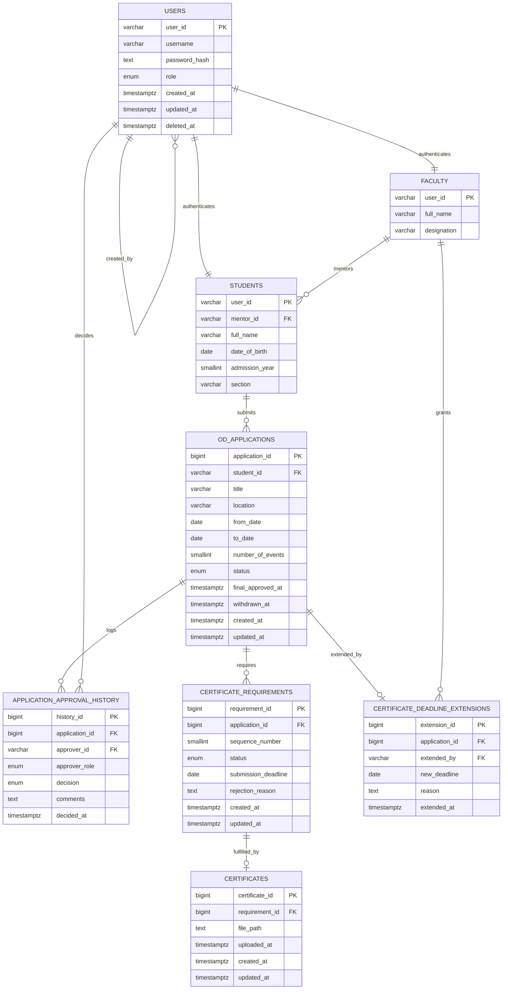

# Database Schema & Data Dictionary

This document serves as the single source of truth for the data layer of the MCET AI&DS OD Approval Web Application. It contains the Entity Relationship Diagram (ERD), detailed table definitions, column types, constraints, and relational mappings.

---

## 1. Entity Relationship Diagram (ERD)

The database schema is relational, utilizing foreign key constraints to maintain referential integrity.

---

## 2. Table Schemas & Column Definitions

### 2.1 USERS
Stores core authentication and system-wide identity records.

| Column | Type | Constraints | Nullable | Description |
| :--- | :--- | :--- | :---: | :--- |
| `user_id` | `varchar` | PRIMARY KEY | No | Unique identity string (e.g., student roll number or faculty code). |
| `username` | `varchar` | UNIQUE | No | Unique system login username. |
| `password_hash` | `text` | - | No | Salted and hashed password using `bcryptjs`. |
| `role` | `enum` | - | No | Roles: `Student`, `Event Coordinator`, `Mentor`, `Program Coordinator`, `Head of Department`, `Administrator`. |
| `created_at` | `timestamptz` | DEFAULT now() | No | Creation timestamp. |
| `updated_at` | `timestamptz` | DEFAULT now() | No | Timestamp of the last profile modification. |
| `deleted_at` | `timestamptz` | - | Yes | Timestamp of soft-delete; null indicates active user. |

### 2.2 STUDENTS
Contains profile information for registered students, inheriting identity from the `USERS` table.

| Column | Type | Constraints | Nullable | Description |
| :--- | :--- | :--- | :---: | :--- |
| `user_id` | `varchar` | PRIMARY KEY, FK (USERS.user_id) | No | Matches the core user record. |
| `mentor_id` | `varchar` | FK (FACULTY.user_id) | No | Identifies the student's assigned Mentor. |
| `full_name` | `varchar` | - | No | Legal full name of the student. |
| `date_of_birth` | `date` | - | No | Date of birth. |
| `admission_year` | `smallint` | - | No | The academic year the student was admitted. |
| `section` | `varchar` | - | No | Class section identifier (e.g., "A", "B"). |

### 2.3 FACULTY
Contains profile details for academic and operational staff.

| Column | Type | Constraints | Nullable | Description |
| :--- | :--- | :--- | :---: | :--- |
| `user_id` | `varchar` | PRIMARY KEY, FK (USERS.user_id) | No | Matches the core user record. |
| `full_name` | `varchar` | - | No | Full name of the faculty member. |
| `designation` | `varchar` | - | No | Staff position description (e.g., "Assistant Professor"). |

### 2.4 OD_APPLICATIONS
Maintains details of the student applications submitted for On-Duty leave.

| Column | Type | Constraints | Nullable | Description |
| :--- | :--- | :--- | :---: | :--- |
| `application_id` | `bigint` | PRIMARY KEY, Auto-increment | No | Unique identifier for each OD application. |
| `student_id` | `varchar` | FK (STUDENTS.user_id) | No | The student submitting the application. |
| `title` | `varchar` | - | No | Name of the event/conference/workshop. |
| `location` | `varchar` | - | No | Location or venue of the event. |
| `from_date` | `date` | - | No | The start date of the OD period. |
| `to_date` | `date` | - | No | The end date of the OD period. |
| `number_of_events` | `smallint` | - | No | Count of distinct academic/sports events in the request. |
| `status` | `enum` | - | No | Application statuses: `Draft`, `In Progress: Event Coordinator`, `In Progress: Mentor`, `In Progress: Program Coordinator`, `In Progress: Head of Department`, `Approved`, `Rejected`, `Withdrawn`. |
| `final_approved_at`| `timestamptz` | - | Yes | The timestamp of final approval (HOD stage). |
| `withdrawn_at` | `timestamptz` | - | Yes | The timestamp if the application was withdrawn by the student. |
| `created_at` | `timestamptz` | DEFAULT now() | No | Submission creation timestamp. |
| `updated_at` | `timestamptz` | DEFAULT now() | No | Last modification timestamp. |

### 2.5 APPLICATION_APPROVAL_HISTORY
Maintains an unmodifiable log of every individual approval or rejection decision.

| Column | Type | Constraints | Nullable | Description |
| :--- | :--- | :--- | :---: | :--- |
| `history_id` | `bigint` | PRIMARY KEY, Auto-increment | No | Unique identifier of the decision log. |
| `application_id` | `bigint` | FK (OD_APPLICATIONS.application_id) | No | The parent OD application. |
| `approver_id` | `varchar` | FK (USERS.user_id) | No | The faculty member making the decision. |
| `approver_role` | `enum` | - | No | Role of the approver when signing off (`Event Coordinator`, etc.). |
| `decision` | `enum` | - | No | Action taken: `Approve` or `Reject`. |
| `comments` | `text` | - | Yes | Optional review or rejection justification comments. |
| `decided_at` | `timestamptz` | DEFAULT now() | No | Exact timestamp of the decision. |

### 2.6 CERTIFICATE_REQUIREMENTS
Represents the requirement for a student to upload a certificate for an approved application.

| Column | Type | Constraints | Nullable | Description |
| :--- | :--- | :--- | :---: | :--- |
| `requirement_id` | `bigint` | PRIMARY KEY, Auto-increment | No | Unique identifier of the requirement. |
| `application_id` | `bigint` | FK (OD_APPLICATIONS.application_id) | No | The parent OD application. |
| `sequence_number`| `smallint` | - | No | Multi-event sequence index. |
| `status` | `enum` | - | No | Statuses: `Pending Upload`, `Uploaded`, `Verified`, `Rejected`, `Deadline Expired`. |
| `submission_deadline`| `date` | - | No | Calculated deadline date (`to_date + 7 days` by default). |
| `rejection_reason`| `text` | - | Yes | Detailed reasons if the certificate was rejected by the EC. |
| `created_at` | `timestamptz` | DEFAULT now() | No | Requirement creation timestamp. |
| `updated_at` | `timestamptz` | DEFAULT now() | No | Requirement update timestamp. |

### 2.7 CERTIFICATES
Stores the path references to student-uploaded certificate assets hosted on OneDrive.

| Column | Type | Constraints | Nullable | Description |
| :--- | :--- | :--- | :---: | :--- |
| `certificate_id` | `bigint` | PRIMARY KEY, Auto-increment | No | Unique identifier of the certificate record. |
| `requirement_id` | `bigint` | FK (CERTIFICATE_REQUIREMENTS.requirement_id) | No | Links to the specific upload requirement. |
| `file_path` | `text` | - | No | The external Microsoft OneDrive Shared Link URL. |
| `uploaded_at` | `timestamptz` | DEFAULT now() | No | Timestamp of the file upload. |
| `created_at` | `timestamptz` | DEFAULT now() | No | Record creation timestamp. |
| `updated_at` | `timestamptz` | DEFAULT now() | No | Record update timestamp. |

### 2.8 CERTIFICATE_DEADLINE_EXTENSIONS
Holds the logs of authorized submission deadline extensions granted by mentors.

| Column | Type | Constraints | Nullable | Description |
| :--- | :--- | :--- | :---: | :--- |
| `extension_id` | `bigint` | PRIMARY KEY, Auto-increment | No | Unique identifier of the extension record. |
| `application_id` | `bigint` | FK (OD_APPLICATIONS.application_id) | No | The parent OD application. |
| `extended_by` | `varchar` | FK (FACULTY.user_id) | No | The Mentor user ID who approved the extension. |
| `new_deadline` | `date` | - | No | The new submission deadline date. |
| `reason` | `text` | - | No | The mentor's justification comment for extending the window. |
| `extended_at` | `timestamptz` | DEFAULT now() | No | The exact timestamp when the extension was saved. |
